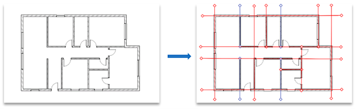
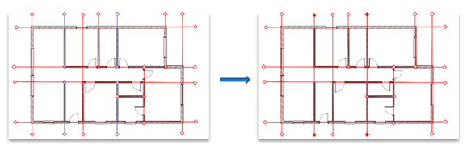

Grids Tab
=================

This tab involves creation of grids based on walls/columns in the Revit model and also allows merging of collinear grids.

Usage
-----

1. Open the Revit model where you want to create grids.
2. Click the ``Create Wall-Grids`` button.
3. This button will identify the orientation of walls and create corresponding grids based on wall centreline.
4. Click the ``Create Column-Grids`` button.
5. This button will identify the location of columns and create corresponding grids based on column centre-points.
6. Click the ``Grid Merge`` button.
7. This button will identify the collinear grids and merge them into single grid.
8. Click the ``Create Wall-Grid Dictionary`` button.
9. This button will create .json file which will consist of Dictionary A, where key shall be Wall Element ID and value shall be Grid Element ID.

Create Wall-Grids
-----------------

*Objective:* This script automates the creation of grids in Revit based on wall orientation.

*Script Anatomy:*

1. Filtered Element Collectors:
The script uses ``FilteredElementCollector`` to retrieve all walls, grids, and structural columns in the Revit model.

2. Wall Orientation:
Walls are categorized into vertical (``v_walls``) and horizontal (``h_walls``) based on their orientation.

3. Create Grids for Vertical Walls:
For each vertical wall, the script checks its length and creates a grid if the length exceeds a specified tolerance.

4. Create Grids for Horizontal Walls:
Similar to vertical walls, the script checks the length of each horizontal wall and creates a grid if the length is above the tolerance.

5. Transaction Management:
Transactions (``t``) are used to manage the creation of grids, ensuring that changes are committed to the Revit model.

6. Grid Creation:
The script creates grids using the ``Grid.Create`` method based on the start and end points of the walls.

The following can be observed in the image below, where input model is on the left, and output of grids along the wall on the right

The following is the python script for ``Create Wall-Grids`` button

.. code-block:: python

    # -*- coding: utf-8 -*-

    # Name of the button displayed in Revit API
    __title__ = "Create Wall-Grids"
    # Description of the tool
    __doc__ = """This is a tool to create grids based on walls"""

    # Import necessary modules
    from Autodesk.Revit.DB import *
    from pyrevit import forms
    import clr
    clr.AddReference("RevitAPI")
    from Autodesk.Revit.DB import Line, Grid, XYZ, Transaction
    from pyrevit import revit, DB

    # Document and UI Variables
    doc = __revit__.ActiveUIDocument.Document
    uidoc = __revit__.ActiveUIDocument
    app = __revit__.Application

    # Filtered Element Collectors

    # Creating grids using wall reference and setting up the particular grid length

    # Get walls, grids, and columns
    all_walls = FilteredElementCollector(doc).OfCategory(BuiltInCategory.OST_Walls).WhereElementIsNotElementType().ToElementIds()
    all_grids = FilteredElementCollector(doc).OfCategory(BuiltInCategory.OST_Grids).WhereElementIsNotElementType().ToElementIds()
    all_columns = FilteredElementCollector(doc).OfCategory(BuiltInCategory.OST_StructuralColumns).WhereElementIsNotElementType().ToElements()

    # Wall Orientation

    v_walls = []
    h_walls = []

    # Categorize walls based on orientation
    for element_id in all_walls:
        Wall = doc.GetElement(element_id)
        Wall_x = Wall.Location.Curve.Origin.X
        Wall_y = Wall.Location.Curve.Origin.Y
        Wall_orientation = abs(Wall.Location.Curve.Direction.Y)

        # Check orientation and categorize walls
        if Wall_orientation == 1:
            v_walls.append(element_id)
        elif Wall_orientation != 1:
            h_walls.append(element_id)

    # Create Grids for Vertical Walls

    # Set wall length tolerance
    wall_length_tolerance = 2.5  # 2.5 feet = 0.75 meter

    for element_id in v_walls:
        Wall = doc.GetElement(element_id)
        wep0 = Wall.Location.Curve.GetEndPoint(0)
        wep1 = Wall.Location.Curve.GetEndPoint(1)

        start = XYZ(wep0[0], wep0[1], 0)
        end = XYZ(wep1[0], wep1[1], 0)

        wall_length = start.DistanceTo(end)

        # Check if wall length is greater than tolerance
        if wall_length >= wall_length_tolerance:
            t = Transaction(doc, 'Create Grid')
            t.Start()

            geomLine = Line.CreateBound(start, end)
            lineGrid = Grid.Create(doc, geomLine)
            
            t.Commit()
            print("Created Grid Successfully")

    # Create Grids for Horizontal Walls

    for element_id in h_walls:
        Wall = doc.GetElement(element_id)
        wep0 = Wall.Location.Curve.GetEndPoint(0)
        wep1 = Wall.Location.Curve.GetEndPoint(1)

        start = XYZ(wep0[0], wep0[1], 0)
        end = XYZ(wep1[0], wep1[1], 0)

        wall_length = start.DistanceTo(end)

        # Check if wall length is greater than tolerance
        if wall_length >= wall_length_tolerance:
            t = Transaction(doc, 'Create Grid')
            t.Start()

            geomLine = Line.CreateBound(start, end)
            lineGrid = Grid.Create(doc, geomLine)
            
            t.Commit()
            print("Created Grid Successfully")

Create Column-Grids
--------------------

*Objective: This script automates the generation of grid lines in Revit, aligning with the positions of structural columns.*

*Script Anatomy:*

1. Filtered Element Collectors:
The script uses ``FilteredElementCollector`` to retrieve all walls, grids, and structural columns in the Revit model.

2. Initialize Lists for Grid Lines:
Two lists (``vertical_lines`` and ``horizontal_lines``) are initialized to store the start and end points of vertical and horizontal grid lines, respectively.

3. Define Grid Length:
The variable ``grid_length`` is set to determine the length of the vertical and horizontal grid lines.

4. Iterate Through Columns:
The script iterates through each structural column to determine its location (``column_location``) and coordinates (``column_x``, ``column_y``).

5. Create Vertical and Horizontal Lines:
Vertical and horizontal lines are created based on the column location and the specified grid length.

6. Transaction Management:
A transaction (``t``) is started to manage the creation of grids, ensuring that changes are committed to the Revit model.

7. Create Vertical Grids:
The script creates vertical grids using the ``Grid.Create`` method and the start and end points of the vertical lines.

8. Create Horizontal Grids:
Similar to vertical grids, the script creates horizontal grids using the start and end points of the horizontal lines.

9. Commit the Transaction:
The transaction is committed to apply the changes to the Revit model.

The following is the python script for ``Create Column-Grids`` button

.. code-block:: python

    # -*- coding: utf-8 -*-

    # Name of the button displayed in Revit API
    __title__ = "Grid Create"
    # Description of the tool
    __doc__ = """This is a tool to create grids based on Columns"""

    # Import necessary modules
    from Autodesk.Revit.DB import *
    from pyrevit import forms
    import clr
    clr.AddReference("RevitAPI")
    from Autodesk.Revit.DB import Line, Grid, XYZ, Transaction
    from pyrevit import revit, DB

    # Document and UI Variables
    doc = __revit__.ActiveUIDocument.Document
    uidoc = __revit__.ActiveUIDocument
    app = __revit__.Application

    # Filtered Element Collectors

    # Get all walls, grids, and columns
    all_walls = FilteredElementCollector(doc).OfCategory(BuiltInCategory.OST_Walls).WhereElementIsNotElementType().ToElementIds()
    all_grids = FilteredElementCollector(doc).OfCategory(BuiltInCategory.OST_Grids).WhereElementIsNotElementType().ToElementIds()
    all_columns = FilteredElementCollector(doc).OfCategory(BuiltInCategory.OST_StructuralColumns).WhereElementIsNotElementType().ToElements()

    # Initialize lists for vertical and horizontal grid lines
    vertical_lines = []
    horizontal_lines = []

    # Define the grid length
    grid_length = 10

    # Iterate through columns to determine orientation and create grid lines
    for column in all_columns:
        column_location = column.Location.Point
        column_x = column_location.X
        column_y = column_location.Y

        # Create a vertical line
        start_point_vertical = XYZ(column_x, column_y - grid_length / 2, 0)
        end_point_vertical = XYZ(column_x, column_y + grid_length / 2, 0)
        vertical_lines.append((start_point_vertical, end_point_vertical))

        # Create a horizontal line
        start_point_horizontal = XYZ(column_x - grid_length / 2, column_y, 0)
        end_point_horizontal = XYZ(column_x + grid_length / 2, column_y, 0)
        horizontal_lines.append((start_point_horizontal, end_point_horizontal))

    # Start a transaction to create grids
    t = Transaction(doc, 'Create Grids')
    t.Start()

    # Create vertical grids
    for start, end in vertical_lines:
        geom_line_vertical = Line.CreateBound(start, end)
        Grid.Create(doc, geom_line_vertical)

    # Create horizontal grids
    for start, end in horizontal_lines:
        geom_line_horizontal = Line.CreateBound(start, end)
        Grid.Create(doc, geom_line_horizontal)

    # Commit the transaction
    t.Commit()

    # Print a message indicating the number of grids created
    # print(f"Created {len(vertical_lines)} vertical grids and {len(horizontal_lines)} horizontal grids.")

Grids Merge
-----------------

*Objective:* This script automates the process of identifying and merging collinear grids in Revit, improving the organization of the building grid layout.

*Script Anatomy:*

1. Filtered Element Collectors:
The script uses ``FilteredElementCollector`` to retrieve all walls and grids in the Revit model.

2. Grouping Grids:
The script separates grids into two lists: ``vertical_grids`` and ``horizontal_grids`` based on their orientation.

3. Get X and Y Coordinates:
X and Y coordinates of the grids are extracted and stored in ``x_coordinates`` and ``y_coordinates`` lists, respectively.

4. Merging Vertical Grids:
It checks if X-coordinates of two consecutive vertical grids are almost the same.
If so, it creates a merged grid using the start and end points of the collinear grids, and deletes the old grids.

5. Merging Horizontal Grids:
Similar to vertical grids, it checks if Y-coordinates of two consecutive horizontal grids are almost the same.
If so, it creates a merged grid using the start and end points of the collinear grids, and deletes the old grids.

6. Tolerance Adjustment:
You can adjust the tolerance value based on your requirements to determine when X or Y coordinates are considered almost the same.

7. Transaction Management:
Transactions are used to manage the creation of merged grids and the deletion of old collinear grids.

This can be observed in the below image, where the grids in blue colour represent the collinear grids, which later on get merged.

The following is the python script for ``Grids Merge`` button

.. code-block:: python

    # -*- coding: utf-8 -*-

    # Name of the button displayed in Revit API
    __title__ = "Grid Merge"
    # Description of the tool
    __doc__ = """This is a tool to merge collinear grids"""

    # Import necessary modules
    # ==================================================
    import clr
    import re

    from Autodesk.Revit.DB import *
    from pyrevit import revit, forms

    # Document and UI Variables
    # ==================================================
    doc = __revit__.ActiveUIDocument.Document
    uidoc = __revit__.ActiveUIDocument
    app = __revit__.Application
    rvt_year = int(app.VersionNumber)

    # FUNCTIONS
    # ==================================================
    def find_minimum_value(values):
        """Find the minimum value from a list of values."""
        min_value = float('inf')  # Initialize with a large value

        for value in values:
            if value < min_value:
                min_value = value

        return min_value

    def find_maximum_value(values):
        """Find the maximum value from a list of values."""
        max_value = float('-inf')  # Initialize with a small value

        for value in values:
            if value > max_value:
                max_value = value

        return max_value

    def extract_element_ids(element_ids):
        """Extract element IDs from a list of ElementId objects."""
        # Convert ElementId objects to string representation
        element_ids_str = str(element_ids)

        # Extract element IDs between square brackets using regular expression
        extracted_ids = re.findall(r'\[([0-9]+)\]', element_ids_str)

        # Convert the extracted strings to integers
        element_ids_int = [int(id_str) for id_str in extracted_ids]

        return element_ids_int

    # MAIN
    # ==================================================

    # GET ALL WALLS
    all_walls = FilteredElementCollector(doc).OfCategory(
        BuiltInCategory.OST_Walls).WhereElementIsNotElementType().ToElementIds()

    # GET ALL GRIDS
    all_grids = FilteredElementCollector(doc).OfCategory(
        BuiltInCategory.OST_Grids).WhereElementIsNotElementType().ToElementIds()

    # Group grids based on their orientation (vertical/horizontal)
    vertical_grids = []
    horizontal_grids = []

    x_coordinates = []
    y_coordinates = []

    x_coordinates_grid_id = {}
    y_coordinates_grid_id = {}

    for element_id in all_grids:
        Grid = doc.GetElement(element_id)
        Grid_orientation = Grid.Curve.Direction.Y
        if Grid_orientation == 1 or Grid_orientation == -1:
            vertical_grids.append(element_id)
        elif Grid_orientation != 1 and Grid_orientation != -1:
            horizontal_grids.append(element_id)

    # Get X-coordinates of vertical grids
    for element_id in vertical_grids:
        grid = doc.GetElement(element_id)
        grid_x = grid.Curve.Origin.X
        x_coordinates.append(grid_x)
    print("x_coordinates: {}".format(x_coordinates))

    # Get Y-coordinates of horizontal grids
    for element_id in horizontal_grids:
        grid = doc.GetElement(element_id)
        grid_y = grid.Curve.Origin.Y
        y_coordinates.append(grid_y)
    print("y_coordinates: {}".format(y_coordinates))

    # MERGING OF VERTICAL GRIDS
    #==========================
    # Check if X-coordinates of two consecutive grids are almost the same
    for i in range(len(x_coordinates) - 1):
        current_x = x_coordinates[i]

        # Iterate over all other x_coordinates
        for j in range(i + 1, len(x_coordinates)):
            other_x = x_coordinates[j]

            # Define a tolerance value for considering X-coordinates as almost the same
            tolerance = 0.01  # You may adjust this value based on your requirements

            # Check if the absolute difference between X-coordinates is within the tolerance
            if abs(other_x - current_x) < tolerance:
                print('Grids {} and {} have almost the same X-coordinate.'.format(i + 1, j + 1))

                # Get the element IDs of the collinear grids
                start_point_id = vertical_grids[i]
                end_point_id = vertical_grids[j]

                # Get the grid elements from the element IDs
                start_point = doc.GetElement(start_point_id)
                end_point = doc.GetElement(end_point_id)

                # Get the start and end points of the collinear grids
                sp = start_point.Curve.GetEndPoint(0)
                ep = end_point.Curve.GetEndPoint(1)

                # Convert start and end points to XYZ objects
                start = XYZ(sp.X, sp.Y, 0)
                end = XYZ(ep.X, ep.Y, 0)

                # Start a transaction to delete old grids and create a merged grid
                t = Transaction(doc, 'Delete old Grid and create merged grid')
                t.Start()

                # Create a new line representing the merged grid
                geom_line = Line.CreateBound(start, end)

                # Create a new grid at the merged line
                merged_grid = Grid.Create(doc, geom_line)

                # Delete the old collinear grids
                doc.Delete(start_point_id)
                doc.Delete(end_point_id)

                t.Commit()
                print("Created Merged Grid Successfully")

    # MERGING OF HORIZONTAL GRIDS
    #============================
    # Check if Y-coordinates of two consecutive grids are almost the same
    for i in range(len(y_coordinates) - 1):
        current_y = y_coordinates[i]

        # Iterate over all other y_coordinates
        for j in range(i + 1, len(y_coordinates)):
            other_y = y_coordinates[j]

            # Define a tolerance value for considering Y-coordinates as almost the same
            tolerance = 0.01  # You may adjust this value based on your requirements

            # Check if the absolute difference between Y-coordinates is within the tolerance
            if abs(other_y - current_y) < tolerance:
                print('Grids {} and {} have almost the same Y-coordinate.'.format(i + 1, j + 1))

                # Get the element IDs of the collinear grids
                start_point_id = horizontal_grids[i]
                end_point_id = horizontal_grids[j]

                # Get the grid elements from the element IDs
                start_point = doc.GetElement(start_point_id)
                end_point = doc.GetElement(end_point_id)

                # Get the start and end points of the collinear grids
                sp = start_point.Curve.GetEndPoint(0)
                ep = end_point.Curve.GetEndPoint(1)

                # Convert start and end points to XYZ objects
                start = XYZ(sp.X, sp.Y, 0)
                end = XYZ(ep.X, ep.Y, 0)

                # Start a transaction to delete old grids and create a merged grid
                t = Transaction(doc, 'Delete old Grid and create merged grid')
                t.Start()

                # Create a new line representing the merged grid
                geom_line = Line.CreateBound(start, end)

                # Create a new grid at the merged line
                merged_grid = Grid.Create(doc, geom_line)

                # Delete the old collinear grids
                doc.Delete(start_point_id)
                doc.Delete(end_point_id)

                t.Commit()
                print("Created Merged Grid Successfully")

Create Wall-Grid Dictionary
---------------------------

*Objective:* This script automates the process of creating a dictionary that maps each wall to its closest grid in Revit.

*Script Anatomy:*

1. Filtered Element Collectors:
The script uses ``FilteredElementCollector`` to retrieve all walls and grids in the Revit model.

2. Grouping Grids:
The script separates grids into two lists: ``v_grids`` for vertical grids and ``h_grids`` for horizontal grids based on their orientation.

3. Conversion Functions:
``feet_to_mm``: Converts feet to millimeters.
``calculate_distance``: Calculates the distance between two points.

4. Extraction Function:
``extract_element_ids_from_dict``: Extracts element IDs from a dictionary by converting keys and values to strings and using regular expressions to extract numeric values.

5. Main Logic:
The script creates a dictionary ``wall_to_grid_mapping`` to map each wall to its closest grid.
It iterates through all walls and finds the closest grid (either vertical or horizontal) based on the distance calculation.
The result is a mapping of wall element IDs to their corresponding closest grid element IDs.

6. Export to JSON:
The script converts the resulting dictionary into a JSON-friendly format and exports it to a JSON file (dictA.json) at a specified directory.

The following is the python script for ``Create Wall-Grid Dictionary`` button

.. code-block:: python

    # -*- coding: utf-8 -*-

    # Name of the button displayed in Revit API
    __title__ = "Create Wall-Grid Dictionary"
    # Description of the tool
    __doc__ = """This is a tool to create Wall-Grid Dictionary"""

    # IMPORTS
    # ==================================================
    import re
    import clr
    clr.AddReference('RevitAPI')
    clr.AddReference('RevitAPIUI')

    import sys
    import math
    import json
    import os

    from Autodesk.Revit.DB import *
    from pyrevit import revit, forms

    #VARIABLES
    # ==================================================
    doc = __revit__.ActiveUIDocument.Document
    uidoc = __revit__.ActiveUIDocument
    app = __revit__.Application
    rvt_year = int(app.VersionNumber)

    # CLASSES & FUNCTIONS
    # ==================================================
    def feet_to_mm(feet):
        """Convert feet to millimeters."""
        inches = feet * 12
        mm = inches * 25.4
        return mm

    def calculate_distance(point1, point2):
        """Calculate the distance between two points."""
        distance = abs(point2 - point1)
        return distance

    def extract_element_ids_from_dict(input_dict):
        """Extract element IDs from a dictionary."""
        extracted_dict = {}

        for key, value in input_dict.items():
            # Extract numeric values from key
            extracted_key = int(re.search(r'\d+', str(key)).group()) if re.search(r'\d+', str(key)) else None

            # Extract numeric values from value
            extracted_value = int(re.search(r'\d+', str(value)).group()) if re.search(r'\d+', str(value)) else None

            # Update the dictionary with extracted key-value pair
            if extracted_key is not None and extracted_value is not None:
                extracted_dict[extracted_key] = extracted_value

        return extracted_dict

    # MAIN
    # ==================================================

    # GET ALL WALLS
    all_walls = FilteredElementCollector(doc).OfCategory(
        BuiltInCategory.OST_Walls).WhereElementIsNotElementType().ToElementIds()

    # GET ALL GRIDS
    all_grids = FilteredElementCollector(doc).OfCategory(
        BuiltInCategory.OST_Grids).WhereElementIsNotElementType().ToElementIds()

    v_grids = []
    h_grids = []

    # Group grids based on their orientation (vertical/horizontal)
    for element_id in all_grids:
        Grid = doc.GetElement(element_id)
        Grid_orientation = Grid.Curve.Direction.Y

        if Grid_orientation == 1 or Grid_orientation == -1:
            v_grids.append(element_id)
        elif Grid_orientation != 1 and Grid_orientation != -1:
            h_grids.append(element_id)

    # Initialize an empty dictionary to store the mapping
    wall_to_grid_mapping = {}

    for element_id in all_walls:
        Wall = doc.GetElement(element_id)

        Wall_orientation = abs(Wall.Location.Curve.Direction.Y)  # V==1 & H!=1

        min_distance = None
        closest_grid_id = None

        for grid_id in v_grids if Wall_orientation == 1 else h_grids:
            Grid = doc.GetElement(grid_id)
            Grid_coordinate = Grid.Curve.Origin.X if Wall_orientation == 1 else Grid.Curve.Origin.Y
            Wall_coordinate = Wall.Location.Curve.Origin.X if Wall_orientation == 1 else Wall.Location.Curve.Origin.Y

            Wall_mm_value = feet_to_mm(Wall_coordinate)
            Grid_mm_value = feet_to_mm(Grid_coordinate)

            distance = calculate_distance(Wall_mm_value, Grid_mm_value)

            if min_distance is None or distance < min_distance:
                min_distance = distance
                closest_grid_id = grid_id

        if closest_grid_id is not None:
            wall_to_grid_mapping[element_id] = closest_grid_id

    # Extract wall-to-grid mapping as a dictionary
    dictA = extract_element_ids_from_dict(wall_to_grid_mapping)

    # Export the dictionary to a JSON file
    directory_path = r'C:\Users\harsh\OneDrive\Documents\newew'
    file_name = 'dictA.json'
    file_path = os.path.join(directory_path, file_name)

    # Check if the provided file path is valid
    if not file_path:
        print("Invalid file path")
    else:
        # Convert both keys and values to strings in the dictionary
        dictA_str = {str(key): str(value) for key, value in dictA.items()}

        # Write the dictionary to a JSON file
        with open(file_path, 'w') as json_file:
            json.dump(dictA_str, json_file, indent=4)
