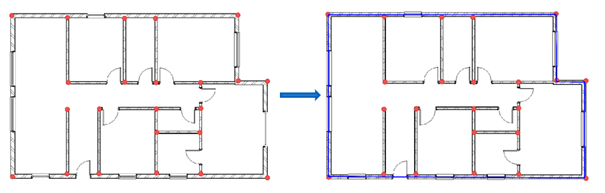

Outer Walls and Grids Tab
=========================

This tab involves determination of outer walls and outer grids.

Usage
-----

**Note: The following steps shall be proceeded after executing the steps from Dimensions Tab**

1. Click the ``Get Boundary Walls`` button.
2. This button identifies the boundary walls in a revit model.
3. Click the ``Get Outline Grids`` button.
4. This button identifies the outline grids in a revit model.

Get Boundary Walls
-------------------

*Objective:* Identify the boundary walls in a Revit model.

*Script Anatomy:*

1. Collect Wall Coordinates: The script collects the coordinates of walls from the previously created dictA dictionary.

2. Compute Convex Hull: Using the Graham's scan algorithm, the script computes the convex hull of the wall coordinates.

3. Identify Matching Wall IDs: It identifies the wall IDs with coordinates similar to the convex hull within a specified tolerance.

4. Print Result: The script prints the matching wall IDs.

The following image depicts the process of identifying boundary walls

The following is the python script for ``Get Boundary Walls`` button

.. code-block:: python

    # -*- coding: utf-8 -*-
    
    # Name of the button displayed in Revit API
    __title__ = "Get Boundary Walls"
    # Description of the tool
    __doc__ = """This is a tool to identify the boundary walls in a model"""

    # IMPORTS
    # ==================================================
    import json
    from math import atan2, pi

    from Autodesk.Revit.DB import *

    # VARIABLES
    # ==================================================
    doc = __revit__.ActiveUIDocument.Document
    app = __revit__.Application

    # MAIN
    # ==================================================

    def convert_to_flat_dict(input_dict):
        # Flatten the input dictionary
        flat_dict = {}
        for key, coordinates_list in input_dict.items():
            for i, coordinates in enumerate(coordinates_list):
                flat_dict['{}_{}'.format(key, i + 1)] = coordinates
        return flat_dict

    def orientation(p, q, r):
        """
        Function to find the orientation of triplet (p, q, r).
        The function returns the following values:
        0: Collinear points
        1: Clockwise points
        2: Counterclockwise
        """
        val = (q[1] - p[1]) * (r[0] - q[0]) - (q[0] - p[0]) * (r[1] - q[1])
        if val == 0:
            return 0  # Collinear
        return 1 if val > 0 else 2  # Clockwise or Counterclockwise

    def graham_scan(points):
        """
        Function to compute the convex hull of a set of points using the Graham's scan algorithm.
        """
        n = len(points)
        if n < 3:
            return "Convex hull not possible with less than 3 points."

        # Find the point with the lowest y-coordinate (and leftmost if tied)
        pivot = min(points, key=lambda point: (point[1], point[0]))

        # Sort the points based on polar angle from the pivot
        sorted_points = sorted(points, key=lambda point: (atan2(point[1] - pivot[1], point[0] - pivot[0]), point))

        # Initialize the convex hull with the pivot and the first two sorted points
        hull = [pivot, sorted_points[0], sorted_points[1]]

        for i in range(2, n):
            while len(hull) > 1 and orientation(hull[-2], hull[-1], sorted_points[i]) != 2:
                hull.pop()
            hull.append(sorted_points[i])

        return hull

    # Specify the path to JSON file containing dictionary A {wall1: grid1, wall2: grid2, wall3: grid2, wall4: grid3}
    file_path_dictA = r'C:\Users\harsh\OneDrive\Documents\newew\dictA.json'

    # Open the JSON file and load its contents into a dictionary
    with open(file_path_dictA, 'r') as file:
        dictA = json.load(file)

    # Collect wall coordinates and create dictC
    wall_coordinates = []
    dictC = {}

    for wall_id, grid_id in dictA.items():
        # Get Wall and Grid elements based on their IDs
        wall = doc.GetElement(ElementId(int(wall_id)))
        wep0 = wall.Location.Curve.GetEndPoint(0)
        wep1 = wall.Location.Curve.GetEndPoint(1)

        wall_coordinates.append((wep0[0], wep0[1]))
        wall_coordinates.append((wep1[0], wep1[1]))

        # Create dictC entries
        dictC[wall_id] = [(round(wep0[0], 3), round(wep0[1], 3)), (round(wep1[0], 3), round(wep1[1], 3))]

    # Compute convex hull of wall coordinates
    rounded_wall_coordinates = [(round(x, 3), round(y, 3)) for x, y in wall_coordinates]
    convex_hull = graham_scan(rounded_wall_coordinates)

    # Identify matching wall IDs with similar coordinates to convex hull
    matching_wall_ids = []

    tolerance = 0.001

    for wall_id, coordinates_list in dictC.items():
        for convex_vertex in convex_hull:
            for coordinates in coordinates_list:
                if all(abs(coord - convex_coord) < tolerance for coord, convex_coord in zip(coordinates, convex_vertex)):
                    matching_wall_ids.append(wall_id)

    # Remove duplicates
    matching_wall_ids = list(set(matching_wall_ids))

    print("Wall IDs with Similar Coordinates to Convex Hull: {}".format(';'.join(matching_wall_ids)))

Get Outline Grids
-----------------

*Objective:* Identify the outline grids in a Revit model.

*Script Anatomy:*

1. Collect Grid Coordinates: The script collects the coordinates of grids from the dictA dictionary.

2. Compute Convex Hull: Similar to the boundary walls script, it computes the convex hull of the grid coordinates using Graham's scan.

3. Identify Matching Grid IDs: It identifies the grid IDs with coordinates similar to the convex hull within a specified tolerance.

4. Print Result: The script prints the matching grid IDs.

The following is the python script for ``Get Outline Grids`` button

.. code-block:: python

    # -*- coding: utf-8 -*-
    __title__ = "Get Outline Grids"
    __doc__ = """This is a tool to identify the outline grids in a model"""

    # IMPORTS
    # ==================================================
    import json
    from math import atan2, pi
    from Autodesk.Revit.DB import *

    # VARIABLES
    # ==================================================
    doc = __revit__.ActiveUIDocument.Document
    app = __revit__.Application

    # MAIN
    # ==================================================

    def convert_to_flat_dict(input_dict):
        # Flatten the input dictionary
        flat_dict = {}
        for key, coordinates_list in input_dict.items():
            for i, coordinates in enumerate(coordinates_list):
                flat_dict['{}_{}'.format(key, i + 1)] = coordinates
        return flat_dict

    def orientation(p, q, r):
        """
        Function to find the orientation of triplet (p, q, r).
        The function returns the following values:
        0: Collinear points
        1: Clockwise points
        2: Counterclockwise
        """
        val = (q[1] - p[1]) * (r[0] - q[0]) - (q[0] - p[0]) * (r[1] - q[1])
        if val == 0:
            return 0  # Collinear
        return 1 if val > 0 else 2  # Clockwise or Counterclockwise

    def atan2(y, x):
        """
        Function to calculate arctangent of y/x without using numpy.
        """
        if x > 0:
            return arctan(y / x)
        elif x < 0 and y >= 0:
            return arctan(y / x) + pi
        elif x < 0 and y < 0:
            return arctan(y / x) - pi
        elif x == 0 and y > 0:
            return pi / 2
        elif x == 0 and y < 0:
            return -pi / 2
        elif x == 0 and y == 0:
            return 0

    def arctan(x):
        """
        Function to calculate arctangent without using numpy.
        """
        angle = 0
        x_squared = x * x
        divisor = 1
        term = x / 1

        while term != 0:
            angle += term
            divisor += 2
            term *= -x_squared / divisor
            divisor += 2
            term /= divisor

        return angle

    def graham_scan(points):
        """
        Function to compute the convex hull of a set of points using the Graham's scan algorithm.
        """
        n = len(points)
        if n < 3:
            return "Convex hull not possible with less than 3 points."

        # Find the point with the lowest y-coordinate (and leftmost if tied)
        pivot = min(points, key=lambda point: (point[1], point[0]))

        # Sort the points based on polar angle from the pivot
        sorted_points = sorted(points, key=lambda point: (atan2(point[1] - pivot[1], point[0] - pivot[0]), point))

        # Initialize the convex hull with the pivot and the first two sorted points
        hull = [pivot, sorted_points[0], sorted_points[1]]

        for i in range(2, n):
            while len(hull) > 1 and orientation(hull[-2], hull[-1], sorted_points[i]) != 2:
                hull.pop()
            hull.append(sorted_points[i])

        return hull

    # Specify the path to JSON file containing dictionary A {wall1: grid1, wall2: grid2, wall3: grid2, wall4: grid3}
    file_path_dictA = r'D:\Software Lab Data\Revit_Plug-ins\Anurag.extension\testplugin.tab\Create Dictionary.panel\Create Dictionary.pushbutton\output.json'

    # Open the JSON file and load its contents into a dictionary
    with open(file_path_dictA, 'r') as file:
        dictA = json.load(file)

    grid_coordinates = []
    dictC = {}

    for wall_id, grid_id in dictA.items():
        # Get Wall and Grid elements based on their IDs
        wall = doc.GetElement(ElementId(int(wall_id)))
        grid = doc.GetElement(ElementId(int(grid_id)))

        gep0 = grid.Curve.GetEndPoint(0)
        gep1 = grid.Curve.GetEndPoint(1)

        grid_coordinates.append((gep0[0], gep0[1]))
        grid_coordinates.append((gep1[0], gep1[1]))

        # Create dictC entries
        dictC[grid_id] = [(round(gep0[0], 3), round(gep0[1], 3)), (round(gep1[0], 3), round(gep1[1], 3))]

    rounded_grid_coordinates = [(round(x, 3), round(y, 3)) for x, y in grid_coordinates]
    convex_hull = graham_scan(rounded_grid_coordinates)

    # Identify matching grid IDs with similar coordinates to convex hull
    matching_grid_ids = []
    tolerance = 0.0001

    for grid_id, coordinates_list in dictC.items():
        for convex_vertex in convex_hull:
            for coordinates in coordinates_list:
                if all(abs(coord - convex_coord) < tolerance for coord, convex_coord in zip(coordinates, convex_vertex)):
                    matching_grid_ids.append(grid_id)

    # Remove duplicates
    matching_grid_ids = list(set(matching_grid_ids))

    # Print the result
    matching_grid_ids_str = [str(grid_id) for grid_id in matching_grid_ids]
    print("Grid IDs with Similar Coordinates to Convex Hull: {}".format(';'.join(matching_grid_ids_str)))
